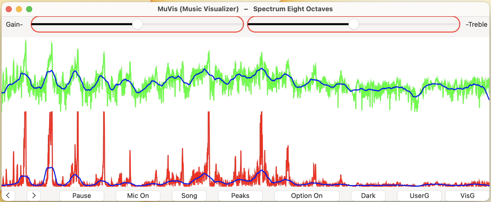

## **MuVis**

MuVis is an open-source multi-platform app (using SwiftUI, Swift, and Xcode) for music visualization. It renders informative (and musically useful) graphical displays in real time from music files being played - or from the device's microphone. Further details are provided in the project's User Guide and Visualizations Guide documents.

This app runs on macOS, iOS, and iPadOS devices. The latest release con be downloaded from the Apple App Store at [(here)](https://apps.apple.com/us/app/muvis-music-visualizer/id1582324352).  And the source code can be downloaded at [(here)](https://github.com/Keith-43).

Real-time music visualization is an exciting endeavor - providing the user with dynamic visual and aural stimulation and edification. I am hoping that others will benefit from my research - and perhaps build upon what I have started. I will strive to continuously improve this app as time allows. Feel free to contact me if you wish to contribute or collaborate. (I am new to Swift programming, so I would appreciate any help from experienced-others who can improve my code.)

When the MuVis app first opens, the on-screen display should look somewhat like:

and the computer's speakers should be playing music from a pre-loaded royalty-free music file. (Currently, the song file is "The Elevator Bossa Nova" from Bensound.com .) The on-screen display shows a real-time dynamic visual representation of the audio that you are hearing.

On your Mac, click-and-drag any corner of this window to freely re-size it to any width and height you wish.

On a Mac, the menu bar at the top shows the app's title "MuVis (Music Visualizer)" followed by the name "Spectrum" of the particular visualization selected for display. On an iPhone or iPad, the menu bar is not displayed.

The bottom toolbar contains buttons and sliders to allow you to control what you see.

At the bottom left are two buttons labelled by left- and right-chevrons. Clicking the left one changes the display to the previous visualization, and clicking the right one changes the display to the next visualization - which allows you to cycle through the twenty-five visualizations currently provided by the app. On a Mac, as a convenient keyboard-shortcut, you also can simply use the left-arrow and right-arrow keyboard keys to cycle back-and-forth among these visualizations.
    
Adjacent to these chevrons is a button labelled “Pause”. When clicked, it stops the music playback and freezes the visualization display. The button label changes to “Resume” which, when clicked, causes the music playback and the visualization display to continue.

The adjacent button is labelled "Mic On". When pressed it stops playing the audio from the selected song file (and also stops it's visualization), and starts playing the live audio from the microphone (and starts it's visualization). The label then becomes "Mic Off" - which, when pressed, performs the reverse actions.

The next button is labelled "Song". (It is disabled and grayed-out if the microphone is enabled.) When the button is clicked, a sub-window pops up to enable the selection of a song to play. On a Mac, it allows you to select whatever songs you want from your own Music folder. Unfortunately, on an iPhone or iPad, the pop-up window allows access only to songs loaded into your iCloud Drive folder. (Apple allows only its own Music app to have access to songs in the iPhone or iPad music library.)

The adjacent button is labelled “Peaks”. When clicked, it passes the audio signal through a “spectral enhancer” filter which enhances the display of spectral lines (usually the harmonics of musical notes) and reduces the display of noise (usually percussive effects which smear spectral energy over a large range.) The label then becomes “Normal” which, when clicked, removes the enhancing filter. (Note that this enhancement applies only to the visual display, not to the audio you are hearing.)

The adjacent button is labelled “Option On”. When programming these visualization algorithms, there are numerous variations and options available. Rather than allowing just one variation, this button allows the user to select to see a second variation. (Perhaps a future release will allow multiple options.) The option rendered is different for each visualization. The user should check out the option for each visualization to see which she likes.

The adjacent button is labelled “Dark”. When clicked, it toggles the app's window to Dark Mode. (Alternatively, if the window is currently in Dark Mode, the button label will be "Light" and when-clicked will toggle the window into Light Mode.) Different visualizations look subjectively better or worse in either Light or Dark Mode.

Finally, at the right end of the bottom toolbar are two buttons labelled UserG (for User Guide) and VisG (for Visualization Guide). Clicking either button activates a “Quick Look” popup window to display the app's documentation. The User Guide explains the functionality of the app's user interface. The Visualization Guide describes the purpose of each visualization - probably in more detail than you want.

The top toolbar contains two sliders - one controlling "Visualization Gain" and the other controlling "Visualization Treble Boost". As their names imply, sliding them adjusts the gain and slope of the visual data representation. (Note that they do NOT adjust the audio levels of the music your are hearing.) They allow subjectively adjusting the display to be the most pleasing - despite whether the musical passage is very quiet or very loud.
